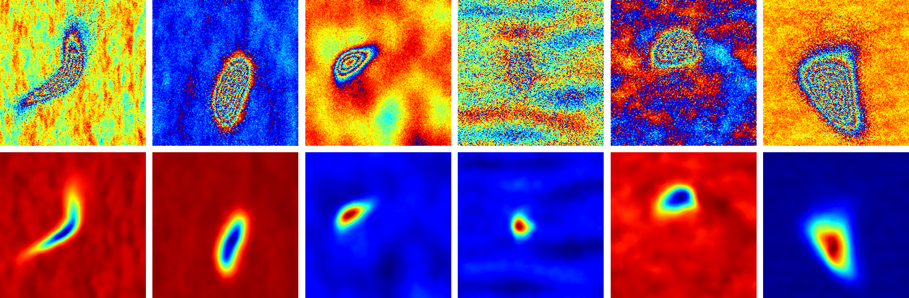

# Deformation-Monitoring
The source code of Paper: **Deep learning for localized rapid deformation detection and InSAR phase unwrapping**

Authors: Zhipeng Wu, *Student Member, IEEE*, Teng Wang, Yingjie Wang, Robert Wang, *Senior Member, IEEE*, Daqing Ge

**If you want to retrain the networks, see [Deformation-Monitoring-Dev](https://github.com/Wu-Patrick/Deformation-Monitoring-Dev).**

---

### Introduction

This is a TensorFlow (1.13.1) implementation of PUNet. It can be used to unwrap interferograms with dense fringes and severe noise. The resolution of the input interferogram should be about 20m×20m. Any size of the interferogram can be input, but 180×180 pixels is recommended. The input data should be binary files (\*.wzp, float32) or Tiff files (\*.tif, float32).

### Installation

The code was tested with Python 3.6.

1. Clone the repo:

   ~~~shell
   git clone https://github.com/Wu-Patrick/Deformation-Monitoring.git
   cd Deformation-Monitorin
   ~~~

2. Install dependencies:

   ~~~shell
   pip install -r requirements.txt
   ~~~

### Unwrapping

1. Input arguments: (see full input arguments via `python runPUNet.py --help`):

~~~shell
usage: runPUNet.py [-h] [--input INPUT] [--output OUTPUT]
                   [--outputPng OUTPUTPNG] [--rows ROWS] [--cols COLS]
                   [--ckpt_dir CKPT_DIR]
~~~

2. Run the example：

~~~shell
python runPUNet.py
# or
python runPUNet.py --input data/dataset1/interf --output data/dataset1/unwrapped --outputPng 1 --rows 180 --cols 180
# or
python runPUNet.py --input data/dataset2/interf/300_20190120-20190201.wzp --output data/dataset2/unwrapped --outputPng 1 --rows 300 --cols 300
~~~

### Acknowledgement

[TensorFlow ](https://tensorflow.google.cn/)

### Statement

The code can only be used for personal academic research testing.